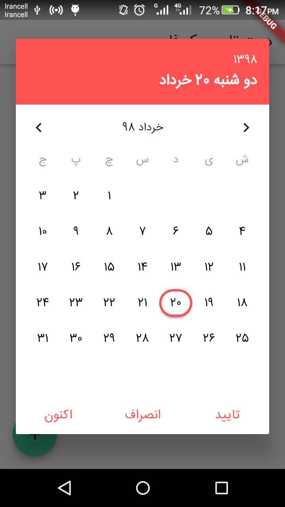
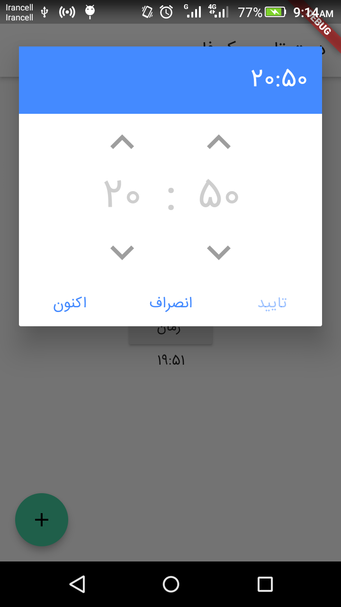
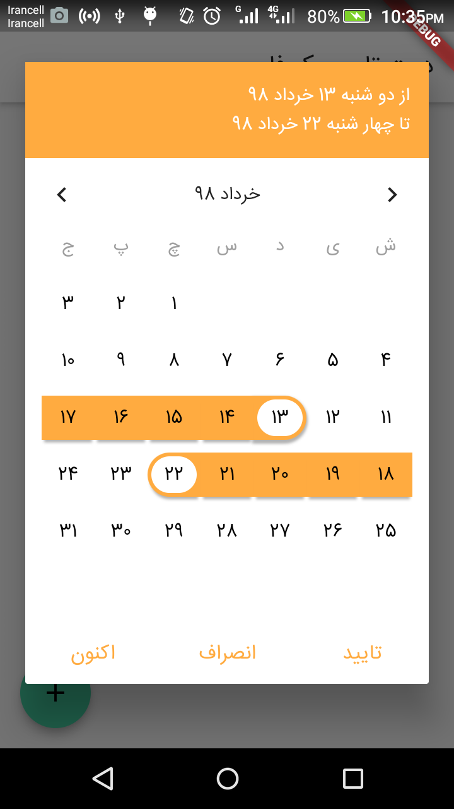
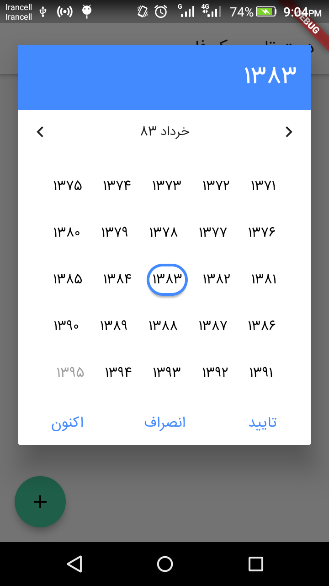
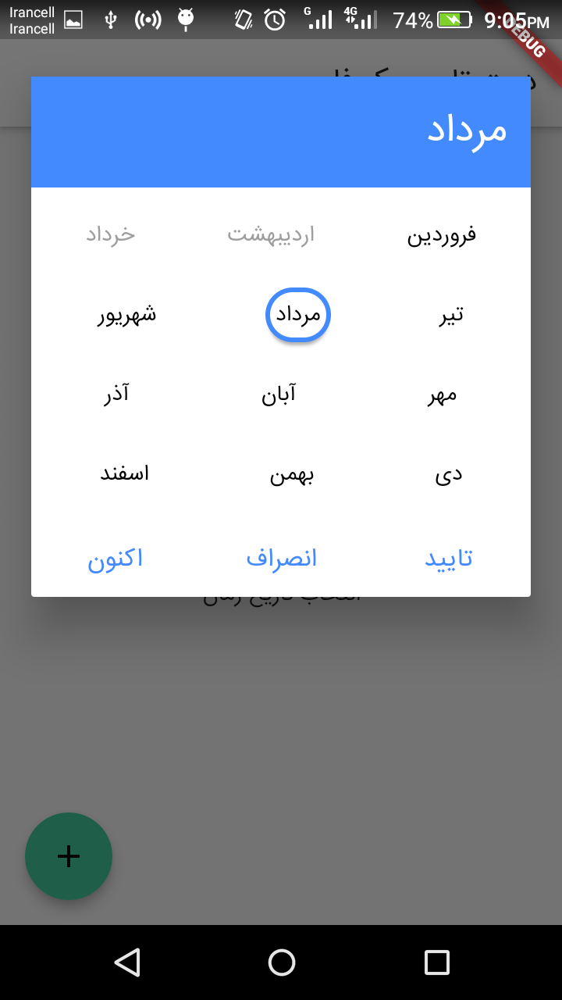

  

# A persian (farsi,shamsi) datetime picker for flutter, inspired by material datetime picker.

  

[](https://pub.dartlang.org/packages/persian_datetime_picker)

  

A Flutter persian datetime picker inspired by material datetime picker and based on [shamsi_date](https://pub.dartlang.org/packages/shamsi_date).

  

You can pick date / range date / time / date and time.

  
  

# Screenshots

|Date picker|Time picker|Range Date picker|Year picker|Month picker|
| ------- | ------- |------- | ------- |------- |
| | | | | |

  
  

## Usage

  

Add it to your pubspec.yaml file:

  

```yaml

dependencies:

persian_datetime_picker: version

```

  

In your library add the following import:

  

```dart

import  'package:persian_datetime_picker/persian_datetime_picker.dart';

```

  

Here is an example how to use:

  

```dart

void  main() => runApp(new  MyApp());

  

class  MyApp  extends  StatelessWidget {

  @override

  Widget  build(BuildContext context) {

    return  new  MaterialApp(

      title: 'Persian datetime picker',

      home: new  MyHomePage(),

    );

    }

}

  

class  MyHomePage  extends  StatefulWidget {

  MyHomePage({Key key, this.title}) : super(key: key);

    

  @override

  _MyHomePageState  createState() => new  _MyHomePageState();

}

  

class  _MyHomePageState  extends  State<MyHomePage> {

  

  void  _showDateTimePicker() {

    showDialog(

      context: context,

      builder: (BuildContext _) {

        return  PersianDateTimePicker(

          initial: '1398/03/20 19:50',

          type: 'datetime',

          onSelect: (date) {

            print(date);

          },

      );

      },

    );

  }

  

  @override

  Widget  build(BuildContext context) {

    return  new  Directionality(

      textDirection: TextDirection.rtl,

      child: Scaffold(

        appBar: new  AppBar(

          title: new  Text('Persian Datetime Picker'),

        ),

        body: new  Center(

          child: Column(

            children: <Widget>[

              RaisedButton(

                onPressed: () {

                _showDateTimePicker();

                },

                child: Text('تاریخ زمان'),

              ),

            ],

          ),

        ),

      ),

    );

  }

}

```

  

You must make dialog like below:

```dart

void  _showDateTimePicker() {

  showDialog(

    context: context,

    builder: (BuildContext _) {

      return  PersianDateTimePicker(

        type: 'datetime',//optional ,default value is date.

        initial: '1398/03/20 19:50',//optional

        onSelect: (date) {

          print(date);

        },

      );

    },

  );

}

```

And after that you can open dialog when call an event:

```dart

onPressed: () {

  _showDateTimePicker();

},

```

## Date time picker parameters and events

| Parameter  | Type | Default | Description |
|-------------------------|---------------------|-----------------------------------------|------------------------------------------------------------------------------                                                                            |
| initial| `String`|  null | Initial picker with a date or time  |
| type| `String`| date| Has six value(`date`,`time`,`datetime`,`rangedate`,`year`,`month`)|
| disable| `String` or `List<String>`|null| Disable dates or time |
| color| `Color`|Colors.blueAccent| Picker theme color |
| min| `String`| null | Minimom Date |
| max| `String`| null| Maximom Date |
| onSelect| `Function(String)`| | This event return a String date or time |

You have six value for `type` parameter .

  

- datetime : when choose datetime type `initial` parameter must be like `'1398/03/20 19:50'` format.

  

- date : when choose date type `initial` parameter must be like `'1398/03/20'` format.

  

- rangedate : when choose rangedate type `initial` parameter must be like `'1398/03/20 # 1398/03/20'` format.

  

- time : when choose time type `initial` parameter must be like `'19:50'` format.

- year: when choose year type `initial` parameter must be like `'1398'` format.

- month: when choose month type `initial` parameter must be like `'03'` format.

##Pull request and feedback are always appreciated.
###Contact me with `mem.amir.m@gmail.com`.
