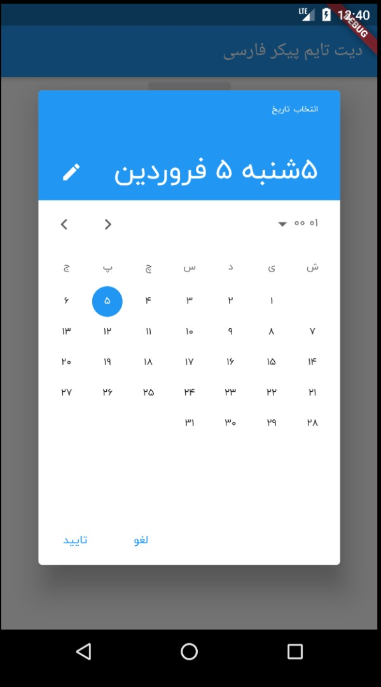
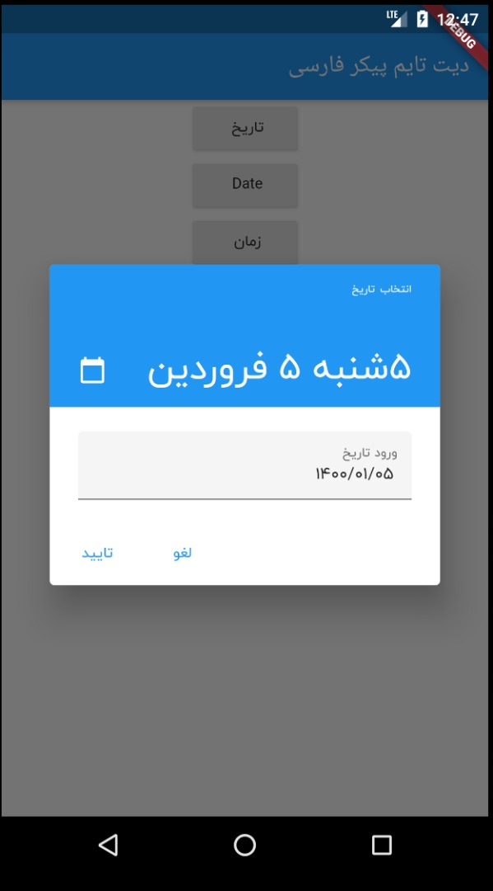
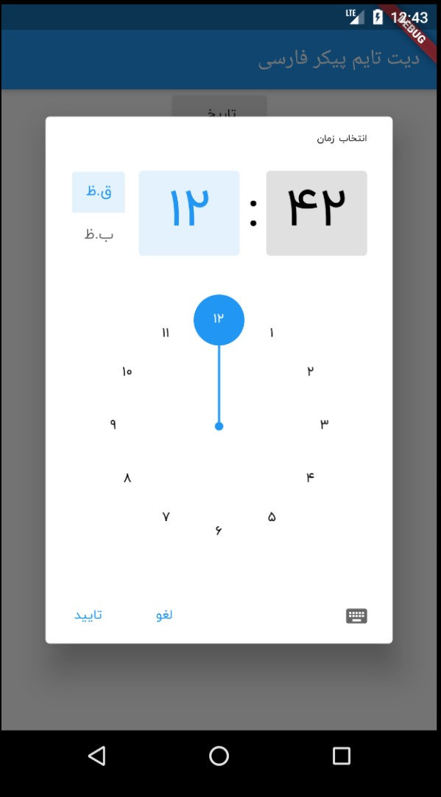
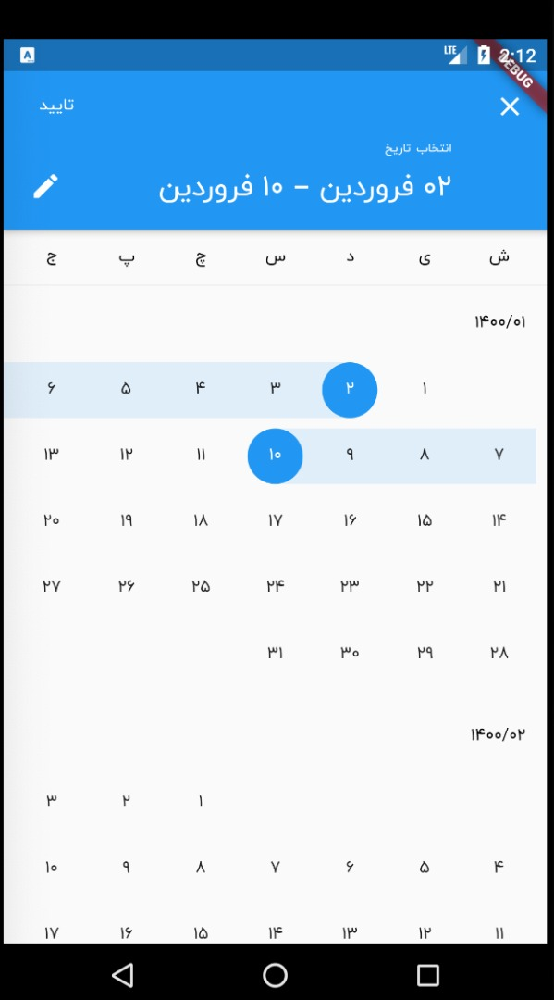

  

# A persian (farsi,shamsi) datetime picker for flutter, inspired by material datetime picker.

  

[](https://pub.dartlang.org/packages/persian_datetime_picker)

  

A Flutter persian datetime picker inspired by material datetime picker and based on [shamsi_date](https://pub.dartlang.org/packages/shamsi_date).

  

You can pick date / range date / time / date and time.

  
  

# Screenshots

||||||
| ------- | ------- |------- | ------- | ------- |
| | | | | |
  
  

## Usage

  

Add it to your pubspec.yaml file:

  

```yaml

dependencies:

persian_datetime_picker: version

```

  

In your library add the following import:

  

```dart

import  'package:persian_datetime_picker/persian_datetime_picker.dart';

```

  

Here is an example how to use:

  
```dart
Jalali picked = await showPersianDatePicker(
    context: context,
    initialDate: Jalali.now(),
    firstDate: Jalali(1385, 8),
    lastDate: Jalali(1450, 9),
);
var label = picked.formatFullDate();

var picked = await showTimePicker(
  context: context,
  initialTime: TimeOfDay.now(),
);
var label = picked.persianFormat(context);

```

 
##Pull request and feedback are always appreciated.
###Contact me with `mem.amir.m@gmail.com`.
