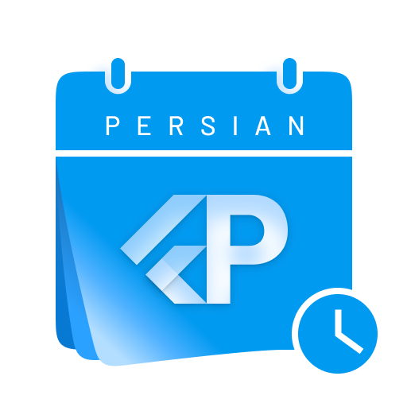
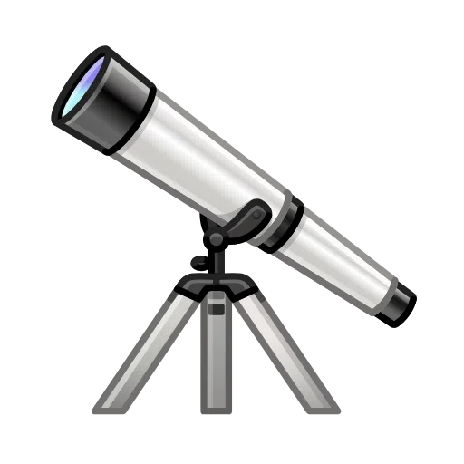
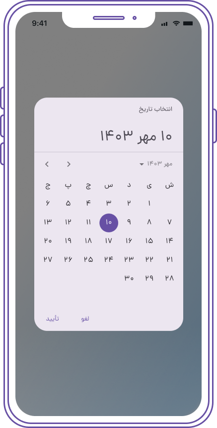
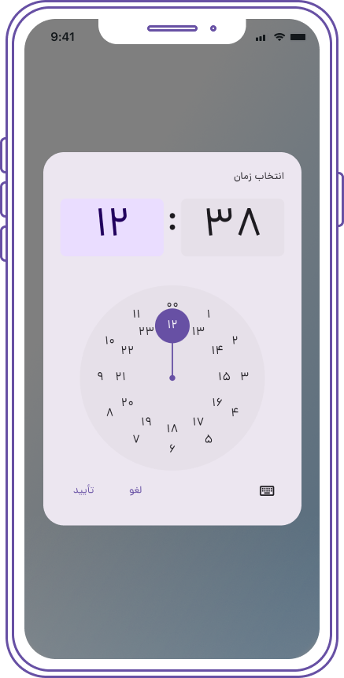
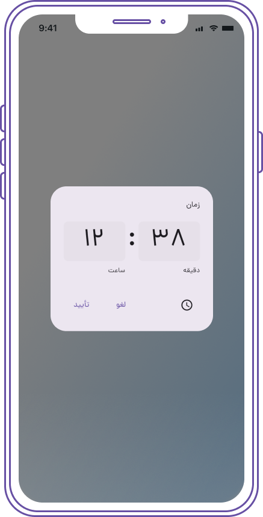
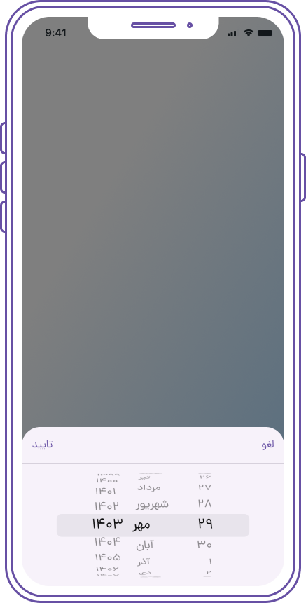
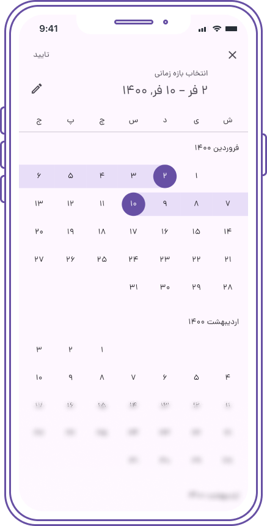
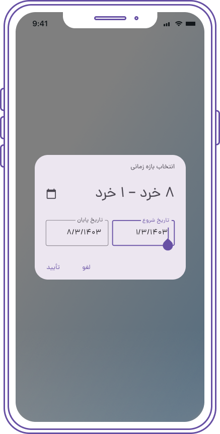

#  Persian (Farsi, Shamsi, Jalali) Date & Time Picker for Flutter

[](https://pub.dartlang.org/packages/persian_datetime_picker) 
[](https://github.com/M-amir-M/persian-datetime-picker/raw/master/sample.apk)


##  Overview
A Persian Date & Time picker inspired by Material Design's DateTime picker, built on the [shamsi_date](https://pub.dartlang.org/packages/shamsi_date) library. It offers full support for the Persian (Jalali) calendar and is highly customizable, including compatibility with Material 3. 

Additionally, it supports multiple languages, including Persian, Dari, Kurdish, Pashto, and custom locales, all while ensuring seamless integration with Flutter and maintaining Material Design standards.

## ️ Features
- 🌟 Fully supports Persian (Jalali) calendar
- 🛠 Highly customizable 
- 💻 Supports Material 3
- 🌎 Multi-language support: Persian, Dari, Kurdish, Pashto, and custom locales
- 📱 Compatible with Material Design standards
- 🧑‍💻 Simple integration with Flutter

## ️ Getting Started

To use the Persian DateTime Picker, add the package to your `pubspec.yaml`:

```yaml
dependencies:
  persian_datetime_picker: <latest_version>
```

Then, import it in your Dart code:

```dart
import 'package:persian_datetime_picker/persian_datetime_picker.dart';
```

Add localization to `MaterialApp`:

```dart
    return MaterialApp(
      title: 'Date and Time Pickers',
      locale: const Locale("fa", "IR"),
      supportedLocales: const [
        Locale("fa", "IR"),
        Locale("en", "US"),
      ],
      localizationsDelegates: const [
        // Add Localization
        PersianMaterialLocalizations.delegate,
        PersianCupertinoLocalizations.delegate,
        //
        GlobalMaterialLocalizations.delegate,
        GlobalWidgetsLocalizations.delegate,
        GlobalCupertinoLocalizations.delegate,
      ],
      ...
    );
```

## ️ Usage Examples

### 1. Persian Date Picker
<p align="center">
  
</p>

```dart
Jalali picked = await showPersianDatePicker(
  context: context,
  initialDate: Jalali.now(),
  firstDate: Jalali(1385, 8),
  lastDate: Jalali(1450, 9),
);
var label = picked.formatFullDate();
```

### 2. Persian Time Picker
<p align="center">
  
  
</p>

```dart
var picked = await showTimePicker(
  context: context,
  initialTime: TimeOfDay.now(),
);
var label = picked.persianFormat(context);
```

### 3. Modal Bottom Sheet with Persian Date Picker
<p align="center">
  
</p>

```dart
Jalali pickedDate = await showModalBottomSheet<Jalali>(
  context: context,
  builder: (context) {
    Jalali tempPickedDate;
    return Container(
      height: 250,
      child: Column(
        children: [
          Row(
            mainAxisAlignment: MainAxisAlignment.spaceBetween,
            children: [
              CupertinoButton(
                child: Text('لغو', style: TextStyle(fontFamily: 'Dana')),
                onPressed: () => Navigator.of(context).pop(),
              ),
              CupertinoButton(
                child: Text('تایید', style: TextStyle(fontFamily: 'Dana')),
                onPressed: () => Navigator.of(context).pop(tempPickedDate ?? Jalali.now()),
              ),
            ],
          ),
          Divider(height: 0, thickness: 1),
          Expanded(
            child: CupertinoTheme(
              data: CupertinoThemeData(
                textTheme: CupertinoTextThemeData(dateTimePickerTextStyle: TextStyle(fontFamily: "Dana")),
              ),
              child: PCupertinoDatePicker(
                mode: PCupertinoDatePickerMode.dateAndTime,
                onDateTimeChanged: (Jalali dateTime) {
                  tempPickedDate = dateTime;
                },
              ),
            ),
          ),
        ],
      ),
    );
  },
);
```

### 4. Persian Date Range Picker
<p align="center">
  
  
</p>

```dart
var picked = await showPersianDateRangePicker(
  context: context,
  initialEntryMode: PDatePickerEntryMode.input,
  initialDateRange: JalaliRange(
    start: Jalali(1400, 1, 2),
    end: Jalali(1400, 1, 10),
  ),
  firstDate: Jalali(1385, 8),
  lastDate: Jalali(1450, 9),
);
```

### 5. Customizing Date Picker Styles

You can customize the styles of the `PersianDateTimePicker` and `PersianCupertinoDatePicker` using the `DatePickerTheme` within your app's `ThemeData`. Additionally, you can apply specific styles by wrapping the date picker with `Theme` in the builder.

#### Example for Persian Date Picker

Add the `DatePickerTheme` to your `ThemeData`:

```dart
return MaterialApp(
  theme: ThemeData(
    // Other theme properties...
    datePickerTheme: DatePickerTheme(
      backgroundColor: Colors.white, // Background color of the date picker
      primaryColor: Colors.teal, // Primary color for the date picker
      textColor: Colors.black, // Text color
      // Customize more properties as needed
    ),
  ),
  // ...
);
```

#### Customizing Persian Date Picker with Theme in Builder

You can also customize the Persian date picker on a per-instance basis by wrapping it with a `Theme` in the builder:

```dart
Jalali? picked = await showPersianDatePicker(
  context: context,
  initialDate: Jalali.now(),
  firstDate: Jalali(1385, 8),
  lastDate: Jalali(1450, 9),
  builder: (context, child) {
    return Theme(
      data: Theme.of(context).copyWith(
        primaryColor: Colors.teal, // Override primary color
        accentColor: Colors.amber, // Override accent color
        // Add more customization here
      ),
      child: child!,
    );
  },
);
```

#### Example for Persian Cupertino Date Picker

To customize the `PersianCupertinoDatePicker`, you can similarly apply a `Theme`:

```dart
showCupertinoModalPopup(
  context: context,
  builder: (context) {
    return Theme(
      data: Theme.of(context).copyWith(
        primaryColor: Colors.teal, // Override primary color
        // Add more customization here
      ),
      child: Container(
        height: 300,
        child: PersianCupertinoDatePicker(
          mode: PersianCupertinoDatePickerMode.dateAndTime,
          onDateTimeChanged: (Jalali dateTime) {
            // Handle date change
          },
        ),
      ),
    );
  },
);
```

### 6. Using Material 2 Instead of Material 3

If you prefer to use Material 2 instead of Material 3 for your application, you can do so by setting the `useMaterial3` parameter to `false` in the `MaterialApp` widget. This ensures that the application uses the Material 2 design principles.

#### Example

Here’s how to set up your `MaterialApp` to use Material 2:

```dart
return MaterialApp(
  title: 'Persian DateTime Picker',
  theme: ThemeData(
    useMaterial3: false, // Set to false to use Material 2
    datePickerTheme: DatePickerTheme(
      backgroundColor: Colors.white,
      primaryColor: Colors.teal,
      textColor: Colors.black,
      // Additional customizations
    ),
  ),
  home: MyHomePage(),
);
```

## ️ Support Us
Feel free to check it out and give it a ️ if you love it. 
Follow me for more updates and projects!

## ️ Contributions and Feedback

Pull requests and feedback are always welcome!  
Feel free to reach out at [mem.amir.m@gmail.com](mailto:mem.amir.m@gmail.com) or connect with me on [LinkedIn](https://www.linkedin.com/in/mohammad-amir-mohammadi/).

*Banner designed by [Nader Mozaffari](https://www.linkedin.com/in/nadermozaffari)*

### ️ Project License:
This project is licensed under the [MIT License](LICENSE).
